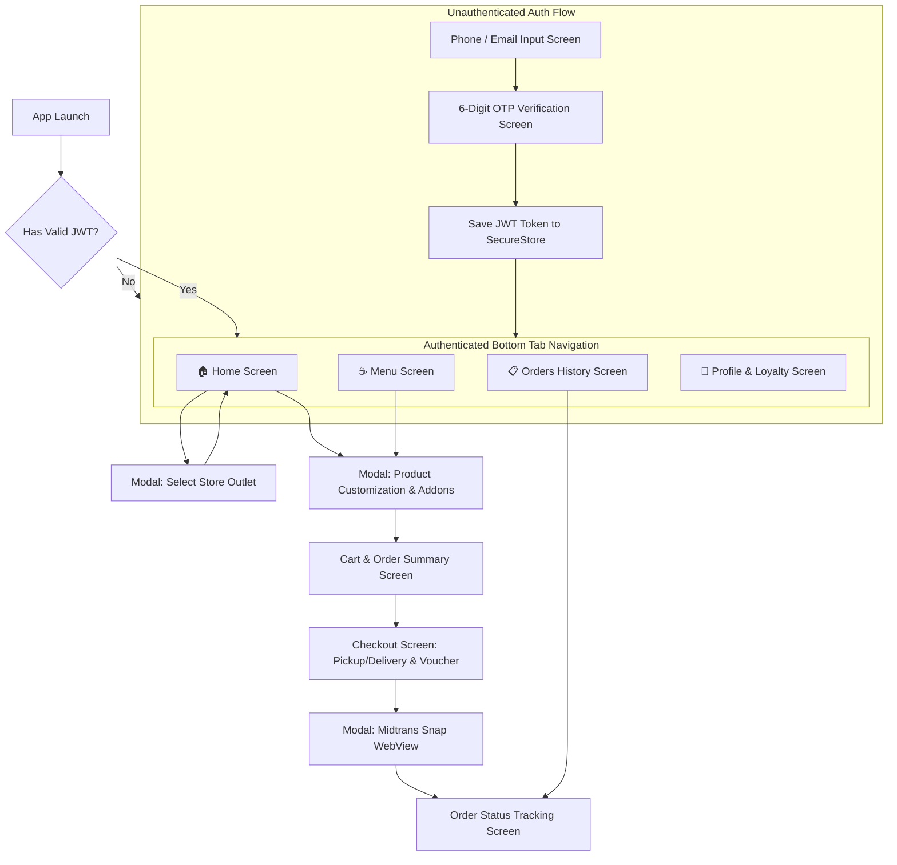

# Screen Navigation Flow & User Journey — ERCoffeeLab Mobile App

## 1. App Navigation Structure Diagram

---

## 2. Screen Breakdown & Visual Requirements

### 2.1 Auth Flow Screens
1. **Login Screen (`(auth)/login.tsx`)**:
   - Header with ERCoffeeLab Gold Logo (`#C9A876`) on Dark Navy (`#181F4B`).
   - Input for WhatsApp Phone Number / Email.
   - Button **"Send OTP Code via WhatsApp"**.
2. **OTP Screen (`(auth)/otp.tsx`)**:
   - 6-digit PIN code input box with countdown timer (60s resend).
   - Verifies OTP code via `POST /api/auth/otp/verify`.
   - On success, saves token in `expo-secure-store` and navigates to Home.

### 2.2 Main Tab Screens
1. **Home Screen (`(main)/index.tsx`)**:
   - **Active Outlet Header Bar**: Displays current outlet name + status badge (🟢 Open). Tapping opens Outlet Selector Modal.
   - **Greeting & Loyalty Mini Bar**: Shows Customer Name & Loyalty Points Balance.
   - **Promo Banners & Quick Bestsellers Carousel**: Displays featured coffee products.
2. **Menu Screen (`(main)/menu.tsx`)**:
   - Horizontal Category Pills (`All`, `Coffee`, `Non-Coffee`, `Pastry`, `Snacks`).
   - Search bar for quick menu filtering.
   - 2-Column Grid Product Cards with Image, Name, Price, Bestseller Badge, and "+ Add" button.
3. **Cart & Checkout Screens (`(main)/cart.tsx` & `checkout.tsx`)**:
   - Toggle selection between **Pickup** (Store Pickup) and **Delivery** (Home Delivery).
   - Selected items list with quantity modifier (+/-) and notes.
   - Promo Voucher Input Box with instant discount preview.
   - Subtotal, Discount, Delivery Fee, and Grand Total Breakdown.
   - Button **"Place Order & Pay with Midtrans"**.
4. **Order Tracking Screen (`(main)/orders/[id].tsx`)**:
   - Live Status Stepper: `Pending` ➔ `Paid` ➔ `Preparing` ➔ `Ready / Delivery` ➔ `Completed`.
   - Order Details breakdown & Delivery Address / Pickup Store Info.
   - Contact Outlet button (WhatsApp chat link).
5. **Profile Screen (`(main)/profile.tsx`)**:
   - Customer Tier Card (Bronze/Silver/Gold/Platinum) with Points Progress Bar.
   - Personal Info Details (Name, Phone, Email, Birth Date).
   - Logout button (Clears `expo-secure-store` token).

---

## 3. Key User Journeys

### Journey A: Daily Coffee Pickup Order Flow
1. Open App ➔ Home Screen displays selected outlet **ERCoffeeLab Bandung Grand City (🟢 Open)**.
2. Tap **"Es Kopi Milk Aren"** ➔ Customization Modal opens.
3. Select Addon **"Extra Shot Espresso (+Rp 5.000)"** and Note **"Less Ice"** ➔ Tap **"Add to Order"**.
4. Tap Floating Cart Bar ➔ Select Mode **"Pickup"** ➔ Input Promo Code **"WELCOME20"** (Diskon Rp 10.000).
5. Tap **"Pay with Midtrans"** ➔ Midtrans WebView Modal opens ➔ Complete Payment via QRIS / GoPay.
6. WebView closes ➔ Order Tracking Screen opens with Live Status **"Preparing Your Coffee ☕"**.
